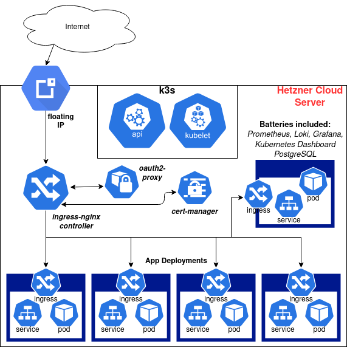

# k8s-infrastructure
Create your own personal Kubernetes infrastructure, the quick and easy way

## Quick start

```bash
## get this repository here
git clone https://github.com/JamesClonk/k8s-infrastructure
cd k8s-infrastructure

# adjust at minimum the following variables:
# HCLOUD_TOKEN, HETZNER_PUBLIC_SSH_KEY
# INGRESS_DOMAIN, INGRESS_BASIC_AUTH_USERNAME, INGRESS_BASIC_AUTH_PASSWORD
# LETS_ENCRYPT_EMAIL_ADDRESS
vi configuration.env.sh

# provision Kubernetes on Hetzner Cloud with CSI driver for persistent volumes
# and install these basic tools and software:
# ingress-nginx, cert-manager, dashboard, prometheus, loki, grafana
./deploy.sh
```

## What is this?

## Installation

## Configuration

## Architecture



### Thoughts & considerations

#### Why not using operators?

Well, this is meant to be used for a *single-user* Kubernetes cluster, whether with only a one or multiple nodes, self-deployed or managed.  While operators are certainly cool pieces of software they don't really make much sense for a single-user scenario, hence I saw no reason to use the prometheus, grafana and postgres operators for those parts of this Kubernetes-infrastructure-as-code project.

#### Why using simple basic-auth for all ingresses?

I was considering and experimenting with using [oauth2-proxy](https://github.com/oauth2-proxy/oauth2-proxy) and [authelia](https://github.com/authelia/authelia), but ultimately made the same decision as with regards to using operators. It simply doesn't make much sense for a single-user Kubernetes cluster, the engineering and operational overhead was not worth it. All I needed are static username+password credentials for securing my applications.

My recommendation would be to use one of these two if you have more requirements than me:
- https://github.com/oauth2-proxy/oauth2-proxy (Simple oauth2 proxy to be used with GitHub for example)
- https://github.com/authelia/authelia (Allows sophisticated auth configuration, 2FA, etc.)

Both can be configured easily to work well together with *ingress-nginx*.

### Components

| Name | Description | URL | 
|-|-|-|
| [K3s](https://k3s.io) | An easy to install, lightweight, fully compliant Kubernetes distribution packaged as a single binary | https://github.com/rancher/k3s |
| [NGINX Ingress Controller](https://kubernetes.github.io/ingress-nginx) | An Ingress controller for Kubernetes using NGINX as a reverse proxy and load balancer | https://github.com/kubernetes/ingress-nginx |
| [cert-manager](https://cert-manager.io) | Automatic certificate management on top of Kubernetes, using [Let's Encrypt](https://letsencrypt.org) | https://github.com/jetstack/cert-manager |
| [Kubernetes Dashboard](https://kubernetes.io/docs/tasks/access-application-cluster/web-ui-dashboard) | General-purpose web UI for Kubernetes clusters | https://github.com/kubernetes/dashboard |
| [kube-state-metrics](https://github.com/kubernetes/kube-state-metrics) | Add-on agent to generate and expose cluster-level metrics | https://github.com/kubernetes/kube-state-metrics |
| [Prometheus](https://prometheus.io) | Monitoring & alerting system, and time series database for metrics | https://github.com/prometheus |
| [Loki](https://grafana.com/oss/loki) | A horizontally-scalable, highly-available, multi-tenant log aggregation system | https://github.com/grafana/loki |
| [Grafana](https://grafana.com/grafana) | Monitoring and metric analytics & dashboards for Prometheus and Loki | https://github.com/grafana/grafana |
| [PostgreSQL](https://www.postgresql.org) | The world's most advanced open source relational database | https://www.postgresql.org/docs |

### Tools used

| Name | Description | URL | 
|-|-|-|
| [Hetzner Cloud](https://www.hetzner.com/cloud) | Command-line interface for interacting with Hetzner Cloud | https://github.com/hetznercloud/cli |
| [kapp](https://get-kapp.io) | Deploy and view groups of Kubernetes resources as applications | [Carvel](https://carvel.dev) (formerly https://k14s.io) |
| [ytt](https://get-ytt.io) | Template and overlay Kubernetes configuration via YAML structures | [Carvel](https://carvel.dev) (formerly https://k14s.io) |
| [vendir](https://github.com/vmware-tanzu/carvel-vendir) | Declaratively state what files should be in a directory | [Carvel](https://carvel.dev) (formerly https://k14s.io) |
| [kbld](https://get-kbld.io) | Seamlessly incorporates image building, pushing, and resolution into deployment workflows | [Carvel](https://carvel.dev) (formerly https://k14s.io) |
| [kapp-controller](https://github.com/vmware-tanzu/carvel-kapp-controller) | Kubernetes controller for Kapp, provides App CRDs | [Carvel](https://carvel.dev) (formerly https://k14s.io) |
| [k9s](https://k9scli.io) | Terminal UI to interact with your Kubernetes clusters | https://github.com/derailed/k9s |

